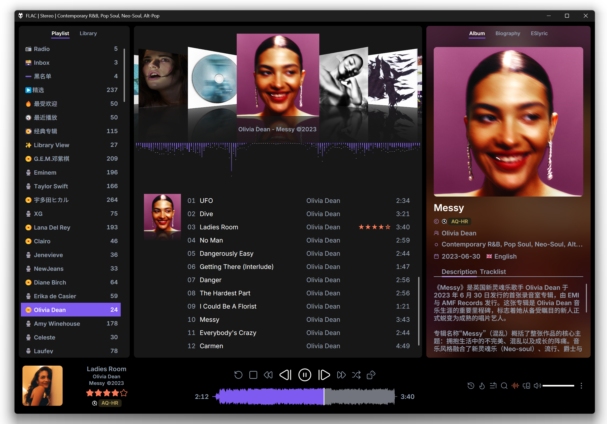
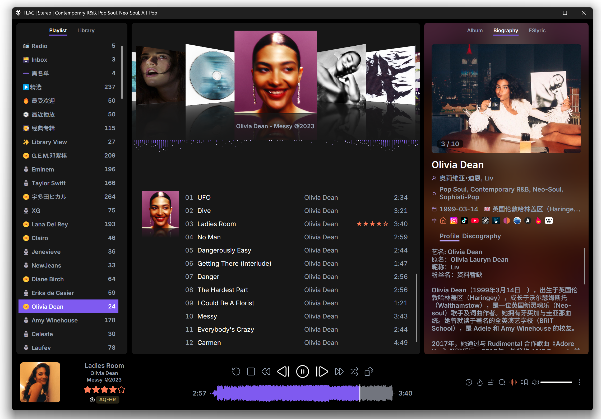
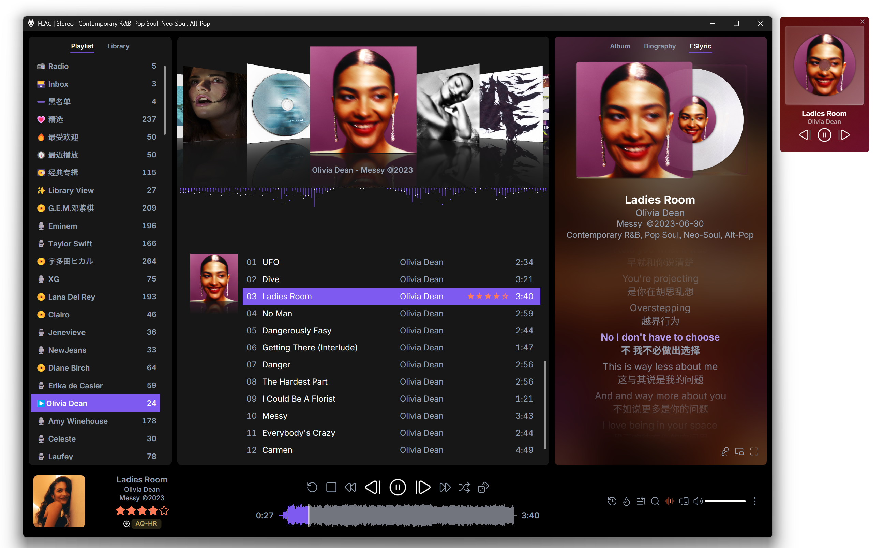
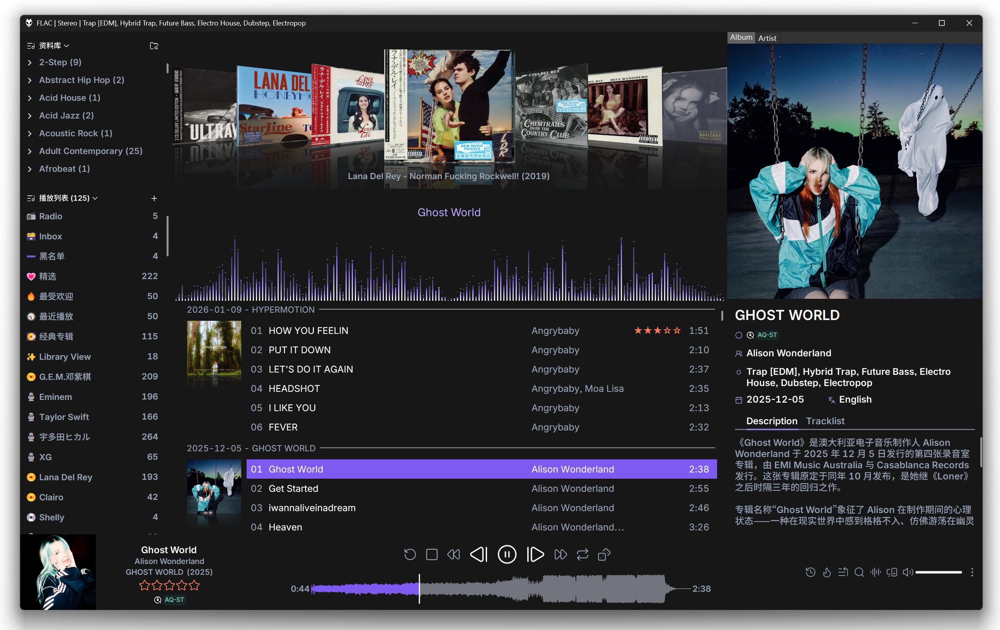
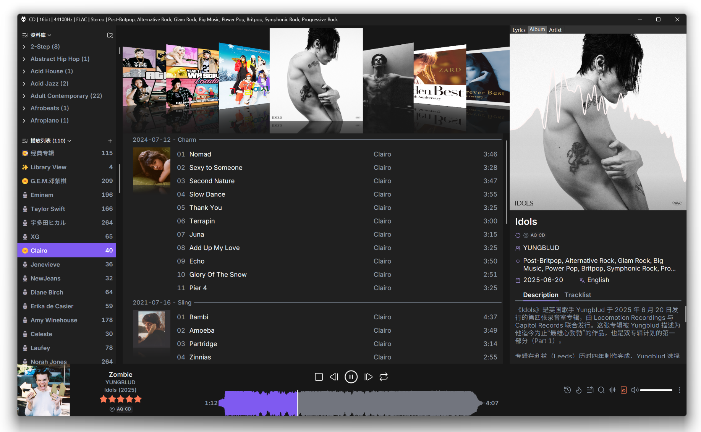
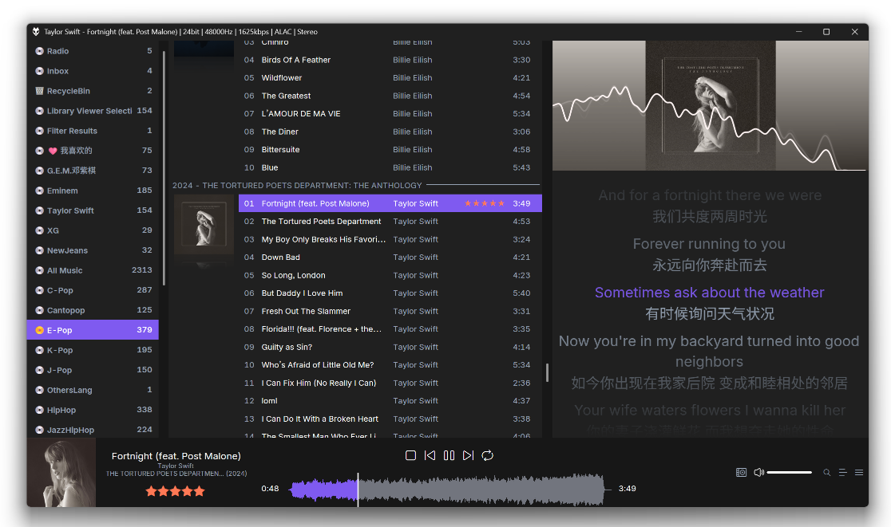
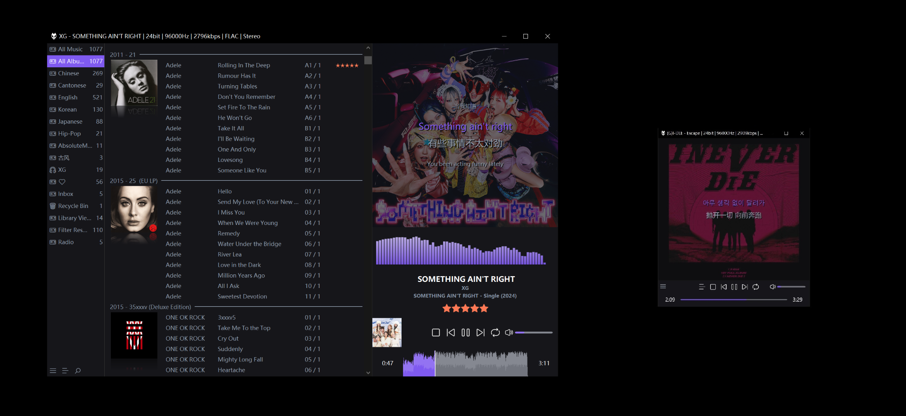

# Changelog

> 版本号遵循 [SemVer](https://semver.org/lang/zh-CN/) (MAJOR.MINOR.PATCH-prerelease)。

## 1.3.0-alpha.1 — 2026-05-18

- JSplitter代替SMP
- JSplitter脚本全部重构并新增背景色等功能
- ESlyric新增多项自定义布局
- 其它...

## 1.2.1 — 2026-01-14

- 调整布局：
  - 歌词面板独立
  - 频谱插件更换为Winamp Spectrum Analyzer visualization
  - 其它细节
- 配色优化
- 脚本优化

## 1.2.0 — 2026-01-01

- `JSpanel3`脚本全部使用`SMP`脚本重构替换，优化性能
- 新增基于`SMP`的艺人、专辑面板，艺人数据来自本地创建的艺人`Json`数据，未引入`last.fm`，专辑数据来自标签
- 引入Coverflow面板

## 1.1.0

## 1.0.0

